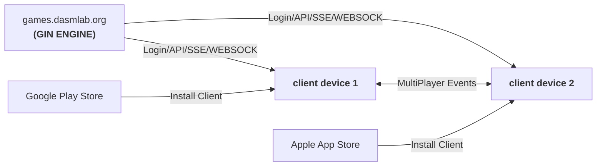

# DASMLAB Card Suite: Cribbage & Beyond

> Modern, cross-platform suite for classic card games.  
> **Phase 1:** Cribbage (multiplayer, bots, slick UX, Go backend)

---

## Architecture Overview

# Features

Cribbage: All modes (1v1, 3-way, 2v2, 3 teams)

Bots: Solo/bot-mixed games

Modern UI: Animated board, avatars, touch/tap friendly

OAuth: Keycloak for secure login/session

Cross-platform: Native mobile + browser

Future-proof: Easy to add more games

# Development Quickstart
(Detailed steps per milestone—see PROJECT.MD for full roadmap)

1. Backend
Go 1.22+, Gin, Logrus, Prometheus

cd backend && go run main.go

2. Client
(After framework selection)

cd client && <build commands for target platform>

3. Game Logic
Pure Go, re-used in backend (and exported for bot/client logic if needed)

# Contributing
Open issues/PRs for ideas or improvements!

Game logic contributions especially welcome

# License
© DASMLAB, 202-5

